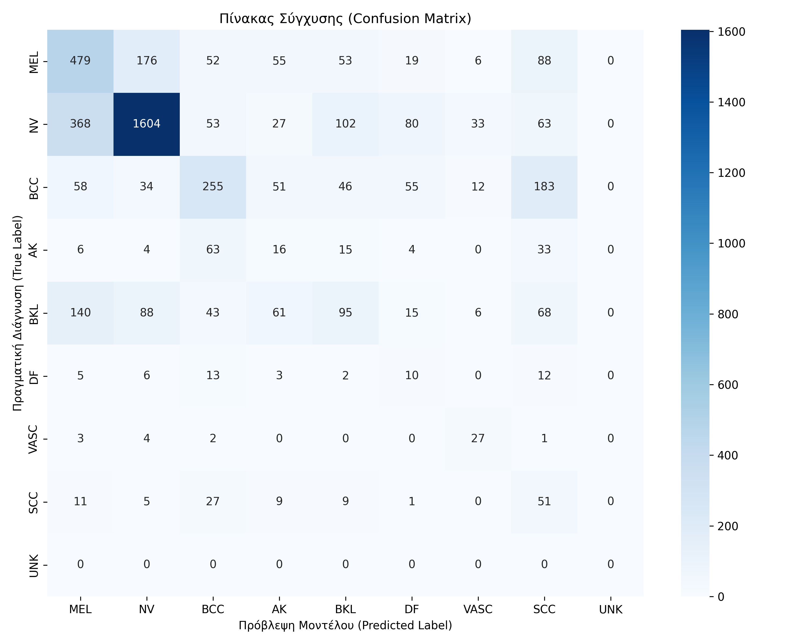
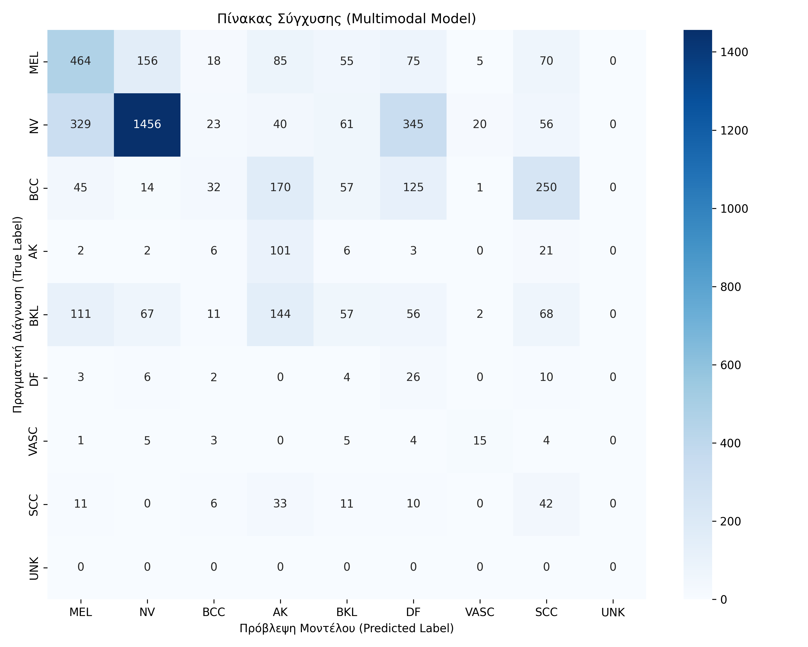
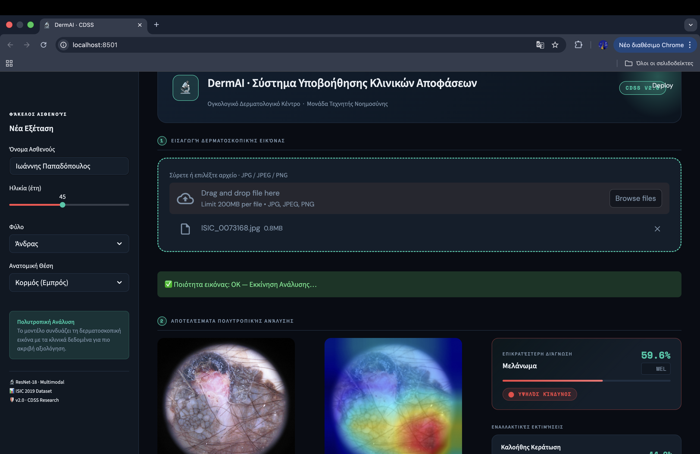

# DermAI 🔬 - Multimodal Clinical Decision Support System (CDSS) for Skin Lesions


**DermAI** is an end-to-end multimodal Clinical Decision Support System (CDSS) designed to assist dermatologists in classifying skin lesions. Developed as part of a B.Sc. Thesis in Applied Informatics at the University of Macedonia (PAMAK).

This project goes beyond simple image classification by combining **Deep Learning (ResNet18)** with **Clinical Metadata**, implementing **Explainable AI (Grad-CAM)**, and featuring a **Content-Based Image Retrieval (CBIR)** system, all wrapped in a modern web interface.

## 🌟 Key Features

* **Multimodal Classification:** Fuses image data with patient clinical metadata (Age, Sex, Anatomical Site) to predict 9 different classes of skin lesions based on the ISIC 2019 dataset.
* **Explainable AI (XAI):** Utilizes Grad-CAM to generate heatmaps, showing doctors exactly which parts of the lesion the neural network focused on to make its prediction.
* **Content-Based Image Retrieval (CBIR):** Extracts feature vectors (512-dim) using ResNet18 to find and display the top 3 most visually similar verified cases from the database.
* **Automated Medical Reporting:** Generates professional, downloadable PDF reports containing patient data, predictions, heatmaps, and medical disclaimers.
* **Apple Silicon Optimized:** Native support for Apple M-series chips (MPS) for accelerated training and inference.

## 📸 Interface Showcase

| Dashboard & Prediction | Explainability (Grad-CAM) & CBIR |
| :---: | :---: |
|  |  |

## 🏗️ Architecture & Methodologies
* **Vision Model:** `ResNet18` (Pre-trained on ImageNet, fine-tuned).
* **Data Fusion:** Late fusion of CNN feature maps with One-Hot Encoded / Scaled clinical metadata.
* **UI Framework:** `Streamlit`.
* **PDF Generation:** `ReportLab`.
* **Preprocessing:** Implements "DullRazor" logic for digital hair removal via OpenCV.

## 📊 Dataset & Evaluation

The model was trained on the **ISIC 2019 Dataset**. Due to the heavy class imbalance of the dataset (majority of images being Nevi - NV and Melanomas - MEL) and hardware constraints limiting epochs (proof-of-concept training), the overall accuracy sits at ~53%. 

*Note: The primary goal of this system is architectural completeness (UI, XAI, CBIR, Reporting) as a foundation for a CDSS, rather than achieving state-of-the-art diagnostic accuracy.*

| Image-only Confusion Matrix | Multimodal Confusion Matrix |
| :---: | :---: |
|  |  |

## 🚀 Installation & Setup

### 1. Clone the repository
```bash
git clone [https://github.com/](https://github.com/)[ΤΟ_USERNAME_ΣΟΥ]/DermAI-Skin-Lesion-CDSS.git
cd DermAI-Skin-Lesion-CDSS

2. Install Dependencies
Ensure you have Python 3.8+ installed. Run:

Bash
pip install -r requirements.txt
3. Setup Project Structure
Due to the size of the datasets and models, they are not included in this repository. Please ensure your local directory follows this structure before running the app:

Plaintext
├── app.py
├── models/
│   └── isic2019_resnet18_multimodal.pth       # Trained PyTorch model
├── data/
│   ├── ISIC_2019_Training_Metadata.csv        # Clinical metadata
│   ├── features_isic2019_resnet18.pkl         # Pre-computed 512-d embeddings for CBIR
│   └── images/                                # ISIC dataset images (for CBIR)
4. Run the Application
Bash
streamlit run app.py
📸 Screenshots
(💡 Tip: Add a folder named assets in your repo, take 2-3 screenshots of your beautiful UI—especially the Grad-CAM heatmaps and the CBIR section—and link them here!)

Example: 

Example: 

👨‍💻 Author
Omiros Loupis Final-year Applied Informatics student & Business Data Analyst

LinkedIn

GitHub

Email: omirosloupis@gmail.com

Disclaimer: This system is developed for academic and research purposes only and does not constitute a certified medical diagnostic tool.
